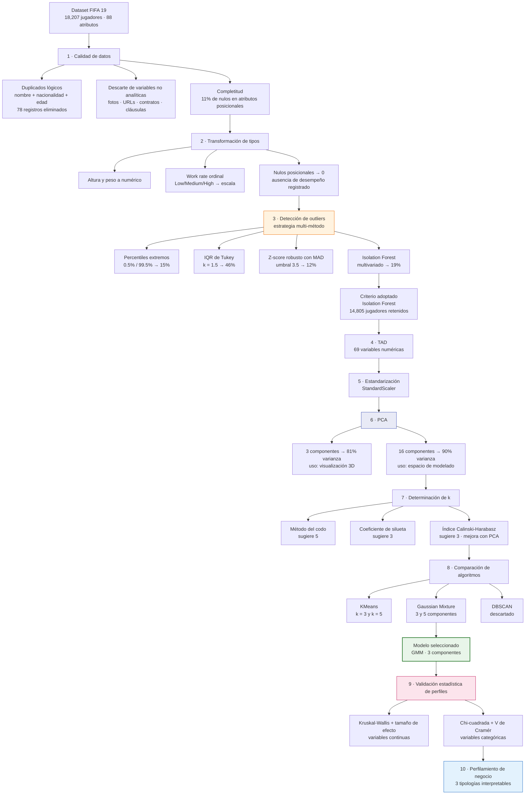

# Segmentación de Jugadores mediante Clustering No Supervisado

**Identificación de tipologías naturales de futbolistas a partir de 69 atributos técnicos, comparando KMeans, GMM y DBSCAN sobre un espacio reducido por PCA — con validación estadística de los perfiles resultantes.**


---

## El problema

El dataset de FIFA 19 describe a cada jugador con **88 atributos**: habilidades técnicas, rendimiento estimado en 26 posiciones distintas, características físicas y datos de contrato. La pregunta que motiva el análisis no es predictiva sino exploratoria:

> **¿Existen tipologías naturales de jugador en los datos, o el talento futbolístico es un continuo sin fronteras?**

Es un problema de aprendizaje no supervisado puro: no hay etiqueta que optimizar ni métrica de negocio que maximizar. El éxito se mide por si los grupos encontrados son **estadísticamente distinguibles** y **semánticamente interpretables**.

Deliberadamente se **excluyó la variable `position` del modelo** y se reservó para perfilar. Si los clústeres reconstruyen la estructura posicional del fútbol sin haberla visto nunca, eso es evidencia de que la segmentación captó algo real.

---

## Datos

| | |
|---|---|
| **Fuente** | FIFA 19 complete player dataset |
| **Volumen inicial** | 18,207 jugadores × 88 atributos |
| **Volumen final** | 14,805 jugadores × 69 variables |
| **Naturaleza** | No supervisado — sin variable objetivo |

---

## Pipeline



---

## Metodología

### Detección de outliers: cuatro métodos, un criterio

En clustering los outliers son especialmente dañinos porque **KMeans minimiza distancias al cuadrado**, así que un puñado de puntos extremos puede arrastrar un centroide completo. El proyecto no se conformó con un solo criterio: implementó una función que aplica cuatro en paralelo y reporta la intersección.

| Método | Naturaleza | Detección |
|---|---|---|
| Percentiles extremos (0.5% / 99.5%) | Univariado | 15% |
| IQR de Tukey (k = 1.5) | Univariado | 46% |
| Z-score robusto con MAD (umbral 3.5) | Univariado robusto | 12% |
| **Isolation Forest** | **Multivariado** | **19%** |

La divergencia entre métodos es el hallazgo interesante. El **IQR marca el 46%** de los jugadores porque evalúa cada variable por separado: con 69 atributos, casi cualquier jugador es atípico en al menos uno. El **Z-robusto** usa mediana y MAD en lugar de media y desviación estándar, por lo que no se contamina con los propios extremos que intenta detectar.

Se adoptó **Isolation Forest** por ser el único criterio multivariado: aísla observaciones raras *en conjunto*, no en cada dimensión aislada, que es la definición correcta de atípico cuando las variables están fuertemente correlacionadas.

### PCA: dos usos, dos configuraciones

La matriz de correlación mostró que casi todas las variables están fuertemente correlacionadas entre sí — algo esperable cuando 26 columnas describen el rendimiento del mismo jugador en 26 posiciones. Esa redundancia es exactamente lo que PCA resuelve.

Se usaron **dos configuraciones distintas para dos propósitos distintos**, y la separación es deliberada:

- **16 componentes (90% de varianza)** → espacio donde se ejecuta el clustering. Preserva casi toda la información eliminando la multicolinealidad.
- **3 componentes (81% de varianza)** → únicamente para visualización 3D de los grupos.

### Determinación del número de grupos: tres criterios

| Criterio | Qué mide | Sugerencia |
|---|---|---|
| **Codo (inercia)** | Suma de distancias intra-clúster | 5 |
| **Coeficiente de silueta** | Cohesión interna vs. separación externa | 3 |
| **Calinski-Harabasz** | Razón de dispersión entre / dentro | 3 |

Dos de tres criterios apuntan a **k = 3**, y ambos índices mejoran al trabajar sobre el espacio PCA en lugar de las 69 variables escaladas — evidencia de que la reducción de dimensionalidad no solo comprimió, sino que **limpió ruido que estaba degradando la estructura de grupos**.

Se modelaron k = 3 y k = 5 para contrastar.

### Comparación de algoritmos

**DBSCAN se descartó con justificación.** El barrido de epsilon por k-distancia y varias configuraciones de `min_samples` produjeron siempre el mismo resultado: **14,366 jugadores en un único grupo y 439 marcados como ruido**. Es el comportamiento esperado de DBSCAN en alta dimensionalidad, donde la densidad se vuelve casi uniforme y la noción de vecindario pierde poder discriminante. Descartarlo con evidencia vale más que forzarlo.

**KMeans vs. GMM** fue la comparación real. La diferencia conceptual es la asignación: KMeans impone **fronteras duras** — cada jugador pertenece a exactamente un grupo — mientras que GMM modela **pertenencia probabilística**, permitiendo que un jugador comparta características de varios perfiles.

**Se seleccionó GMM con 3 componentes**, con distribución notablemente equilibrada:

| Grupo | Jugadores | Proporción |
|---|---|---|
| GMM 1 | 5,145 | 35% |
| GMM 2 | 5,052 | 34% |
| GMM 3 | 4,608 | 31% |

Que ningún grupo domine es señal de que el preprocesamiento y el escalado funcionaron: un clustering mal hecho suele producir un grupo gigante y varios residuales.

---

## Validación estadística de los perfiles

Esta es la parte que distingue el proyecto de una segmentación descriptiva. Encontrar grupos es fácil; **demostrar que son estadísticamente distintos** requiere pruebas formales.

### Variables continuas — Kruskal-Wallis

Se aplicó la prueba de Kruskal-Wallis a cada atributo, comparando su distribución entre los tres grupos. Es la alternativa no paramétrica al ANOVA: **no asume normalidad**, lo cual importa porque muchos atributos de FIFA tienen distribuciones sesgadas o bimodales.

Además del p-valor se calculó un **tamaño de efecto**, filtrando las variables cuya diferencia es significativa pero irrelevante. Con casi 15,000 observaciones, prácticamente cualquier diferencia resulta significativa; el tamaño de efecto es lo que separa señal de trivialidad.

### Variables categóricas — Chi-cuadrada y V de Cramér

Para nacionalidad y club se usó chi-cuadrada de independencia junto con la **V de Cramér** como medida de asociación normalizada, filtrando por alta cardinalidad y tamaño mínimo de muestra.

### Qué separa a los grupos

El ranking por tamaño de efecto reveló que la segmentación se organiza sobre el **eje defensa–ataque**, no sobre nivel ni edad:

| Variable | Interpretación |
|---|---|
| `slidingtackle`, `standingtackle` | Capacidad defensiva de recuperación |
| `lcb`, `cb`, `rcb` | Desempeño como defensa central |
| `interceptions`, `marking` | Lectura defensiva y marcaje |
| `finishing` | Definición ofensiva |

**Edad, `overall` y `potential` resultaron poco discriminantes.** Ese es el resultado más informativo del análisis: el modelo **no separó por qué tan bueno es un jugador, sino por qué tipo de jugador es**. Habiendo excluido `position` del entrenamiento, los clústeres reconstruyeron la estructura posicional del fútbol únicamente a partir de atributos técnicos.

---

## Perfiles resultantes

### Perfil 1 — Completos y versátiles (35%)

Valor más alto en `special`, la suma global de habilidades. Buen nivel en `skill_moves` y `weak_foot`, con desempeño competente en múltiples posiciones ofensivas y de medio campo. No destacan por físico sino por **calidad técnica integral**.

> *Jugadores confiables que rinden bien en varias posiciones y sistemas.*

### Perfil 2 — Físicos y de rol defensivo (34%)

Valores bajos en variables ofensivas (`finishing`, `skill_moves`) y mayor peso promedio. Menor creatividad, mayor disciplina táctica. Perfiles con funciones específicas y bien delimitadas.

> *Jugadores que sostienen el sistema desde atrás y priorizan el orden.*

### Perfil 3 — Ofensivos y creativos (31%)

Mejores valores en `skill_moves`, `weak_foot` y `work_rate`. Alto desempeño en delantero, extremo y mediapunta. Menos físicos, más orientados a técnica y movilidad.

> *Jugadores desequilibrantes, decisivos en el último tercio.*

---

## KMeans vs. GMM: la conclusión metodológica

Ambos algoritmos encontraron tres grupos coherentes, pero **responden preguntas distintas**:

| | KMeans | GMM |
|---|---|---|
| Asignación | Frontera dura | Probabilística |
| Separa por | Rol táctico y posición | Tipología y estilo |
| Variable más discriminante | `special` (nivel global) | `slidingtackle` (rol defensivo) |
| Ventaja | Claridad geométrica, fácil de explicar | Realismo, captura gradientes |
| Uso ideal | Segmentación operativa, reglas simples | Análisis exploratorio, interpretación |

> **KMeans responde mejor a "¿a qué grupo pertenece este jugador?". GMM responde mejor a "¿qué tipo de jugador es?".**

Se eligió GMM porque el dominio lo justifica: el talento futbolístico no tiene fronteras duras, y un jugador puede parecerse parcialmente a varios perfiles. Modelar esa ambigüedad es más fiel que forzar una asignación exclusiva.

---

## Limitaciones y siguientes pasos

- [ ] **Validar contra `position` con Adjusted Rand Index.** Es la mejora de mayor valor y está a un paso. La variable se excluyó del modelo precisamente para servir de validación externa; calcular el ARI entre los clústeres y la posición real cuantificaría objetivamente cuánta estructura futbolística real capturó el modelo, en lugar de describirla cualitativamente.
- [ ] **Revisar el impacto de eliminar el 19% de los datos.** Isolation Forest descartó 3,363 jugadores. Es probable que una parte importante sean **porteros** (2,017 en el dataset), cuyos atributos son estructuralmente distintos al resto. Si es así, el modelo está segmentando jugadores de campo tras haber eliminado silenciosamente una posición entera. Conviene cruzar los outliers detectados contra `position` y considerar modelar porteros por separado.
- [ ] **Reportar el valor absoluto del coeficiente de silueta.** Ronda 0.3, lo cual indica estructura real pero con solapamiento considerable. Es honesto documentarlo: refuerza el argumento a favor de GMM sobre KMeans.
- [ ] **Recodificar `work_rate` como dos variables ordinales.** Actualmente se colapsa a un único float concatenando ataque y defensa, lo que hace que las distancias euclidianas entre valores no tengan significado. Separarlo en dos columnas es más correcto.
- [ ] **Corregir la conversión de altura.** El formato pies-pulgadas se transforma reemplazando el apóstrofo por punto, lo que produce escalas no lineales. La conversión correcta es a centímetros.
- [ ] **Persistir `StandardScaler`, `PCA` y el modelo GMM** para poder asignar jugadores nuevos sin reentrenar el pipeline completo.
- [ ] **Explorar clustering jerárquico** con dendrograma y coeficiente cofenético, ya importado pero no ejecutado, para visualizar si los tres grupos se subdividen de forma natural.
- [ ] **Validar la estabilidad de los clústeres** mediante bootstrap o remuestreo, verificando que las asignaciones no dependan de la semilla.

---

## Estructura del repositorio

```
.
├── README.md
├── notebooks/
│   └── segmentacion_jugadores.ipynb
├── src/
│   └── utils.py                   # detección de outliers, perfilamiento, ranking
└── data/
    └── data_fifa.csv              # no versionado
```

---

## Stack

`Python` · `pandas` · `NumPy` · `scikit-learn` · `SciPy` · `Plotly` · `Seaborn` · `Yellowbrick`

## Técnicas aplicadas

Detección de outliers multi-método (IQR, percentiles, Z robusto con MAD, Isolation Forest) · Análisis de Componentes Principales · KMeans · Gaussian Mixture Models · DBSCAN · Coeficiente de silueta · Índice Calinski-Harabasz · Método del codo · Kruskal-Wallis · Chi-cuadrada y V de Cramér · Perfilamiento e interpretación de segmentos

---

## Autor

**Alfredo** — Data Engineer / Data Scientist
